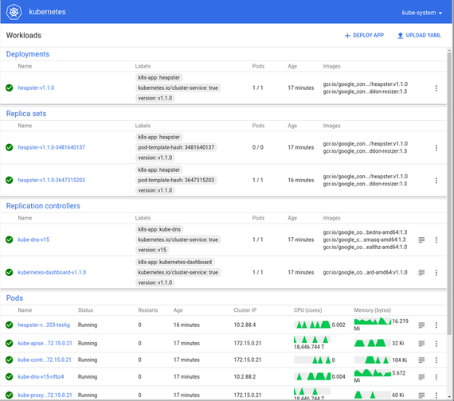

# Kubernetes

The Kubernetes example provisions a 3 node Kubernetes v1.5.2 cluster with one controller, two workers, and TLS authentication. An etcd cluster backs Kubernetes and coordinates CoreOS auto-updates (enabled for disk installs).

## Requirements

Ensure that you've gone through the [matchbox with rkt](getting-started-rkt.md) or [matchbox with docker](getting-started-docker.md) guide and understand the basics. In particular, you should be able to:

* Use rkt or Docker to start `matchbox`
* Create a network boot environment with `coreos/dnsmasq`
* Create the example libvirt client VMs
* `/etc/hosts` entries for `node[1-3].example.com` (or pass custom names to `k8s-certgen`)

## Examples

The [examples](../examples) statically assign IP addresses to libvirt client VMs created by `scripts/libvirt`. VMs are setup on the `metal0` CNI bridge for rkt or the `docker0` bridge for Docker. The examples can be used for physical machines if you update the MAC addresses. See [network setup](network-setup.md) and [deployment](deployment.md).

* [k8s](../examples/groups/k8s) - iPXE boot a Kubernetes cluster
* [k8s-install](../examples/groups/k8s-install) - Install a Kubernetes cluster to disk
* [Lab examples](https://github.com/dghubble/metal) - Lab hardware examples

### Assets

Download the CoreOS image assets referenced in the target [profile](../examples/profiles).

    ./scripts/get-coreos stable 1235.9.0 ./examples/assets

Optionally, add your SSH public key to each machine group definition [as shown](../examples/README.md#ssh-keys).

Generate a root CA and Kubernetes TLS assets for components (`admin`, `apiserver`, `worker`) with SANs for `node1.example.com`, etc.

    rm -rf examples/assets/tls
    ./scripts/tls/k8s-certgen

**Note**: TLS assets are served to any machines which request them, which requires a trusted network. Alternately, provisioning may be tweaked to require TLS assets be securely copied to each host.

## Containers

Use rkt or docker to start `matchbox` and mount the desired example resources. Create a network boot environment and power-on your machines. Revisit [matchbox with rkt](getting-started-rkt.md) or [matchbox with Docker](getting-started-docker.md) for help.

Client machines should boot and provision themselves. Local client VMs should network boot CoreOS in about a 1 minute and the Kubernetes API should be available after 3-4 minutes (each node downloads a ~160MB Hyperkube). If you chose `k8s-install`, notice that machines install CoreOS and then reboot (in libvirt, you must hit "power" again). Time to network boot and provision Kubernetes clusters on physical hardware depends on a number of factors (POST duration, boot device iteration, network speed, etc.).

## Verify

[Install kubectl](https://coreos.com/kubernetes/docs/latest/configure-kubectl.html) on your laptop. Use the generated kubeconfig to access the Kubernetes cluster created on rkt `metal0` or `docker0`.

    $ KUBECONFIG=examples/assets/tls/kubeconfig
    $ kubectl get nodes
    NAME                STATUS    AGE
    node1.example.com   Ready     3m
    node2.example.com   Ready     3m
    node3.example.com   Ready     3m

Get all pods.

    $ kubectl get pods --all-namespaces
    NAMESPACE     NAME                                        READY     STATUS    RESTARTS   AGE
    kube-system   heapster-v1.2.0-4088228293-5xbgg            2/2       Running   0          41m
    kube-system   kube-apiserver-node1.example.com            1/1       Running   0          40m
    kube-system   kube-controller-manager-node1.example.com   1/1       Running   0          40m
    kube-system   kube-dns-782804071-326dd                    4/4       Running   0          41m
    kube-system   kube-dns-autoscaler-2715466192-8bm78        1/1       Running   0          41m
    kube-system   kube-proxy-node1.example.com                1/1       Running   0          41m
    kube-system   kube-proxy-node2.example.com                1/1       Running   0          41m
    kube-system   kube-proxy-node3.example.com                1/1       Running   0          40m
    kube-system   kube-scheduler-node1.example.com            1/1       Running   0          40m
    kube-system   kubernetes-dashboard-3543765157-2nqgh       1/1       Running   0          41m

## Kubernetes Dashboard

Access the Kubernetes Dashboard with `kubeconfig` credentials by port forwarding to the dashboard pod.

    $ kubectl port-forward kubernetes-dashboard-SOME-ID 9090 -n=kube-system
    Forwarding from 127.0.0.1:9090 -> 9090

Then visit [http://127.0.0.1:9090](http://127.0.0.1:9090/).

