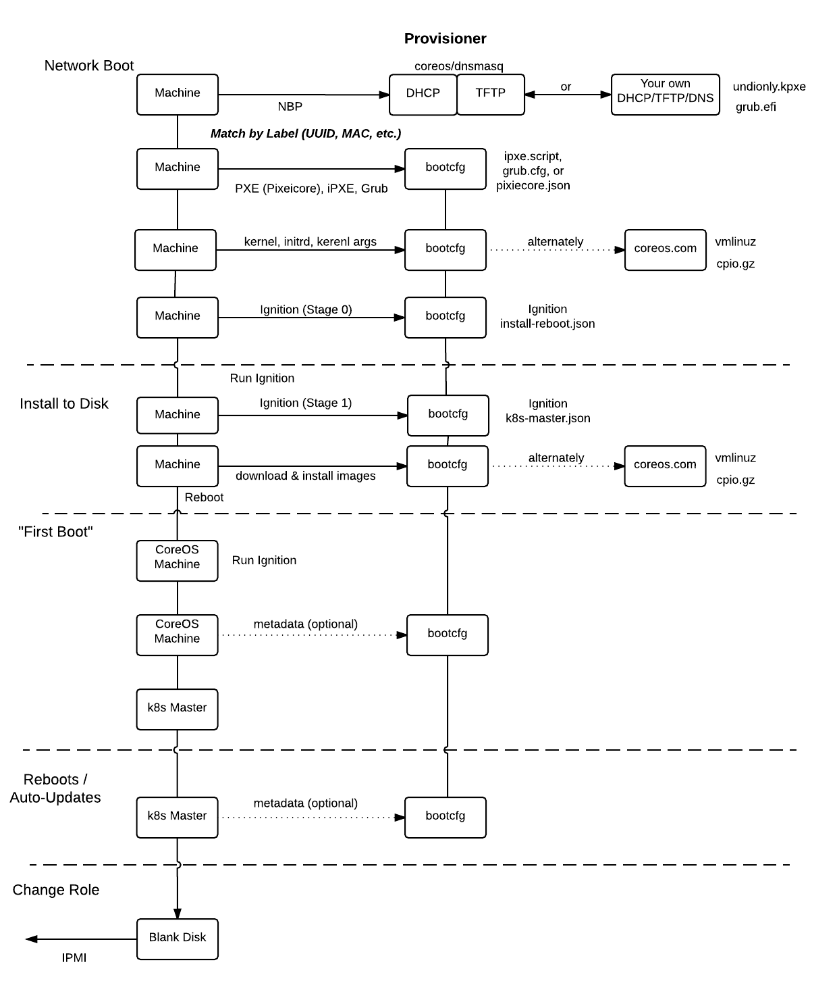

# Lifecycle of a physical machine

## About boot environment

Physical machines [network boot](network-booting.md) in an network boot environment with DHCP/TFTP/DNS services or with [coreos/dnsmasq](../contrib/dnsmasq).

`matchbox` serves iPXE, GRUB, or Pixiecore boot configs via HTTP to machines based on Group selectors (e.g. UUID, MAC, region, etc.) and machine Profiles. Kernel and initrd images are fetched and booted with Ignition to install CoreOS. The "first boot" Ignition config if fetched and CoreOS is installed.

CoreOS boots ("first boot" from disk) and runs Ignition to provision its disk with systemd units, files, keys, and more to become a cluster node. Systemd units may fetch metadata from a remote source if needed.

Coordinated auto-updates are enabled. Systems like [fleet](https://coreos.com/docs/#fleet) or [Kubernetes](http://kubernetes.io/docs/) coordinate container services. IPMI, vendor utilities, or first-boot are used to re-provision machines into new roles.

## Machine lifecycle

