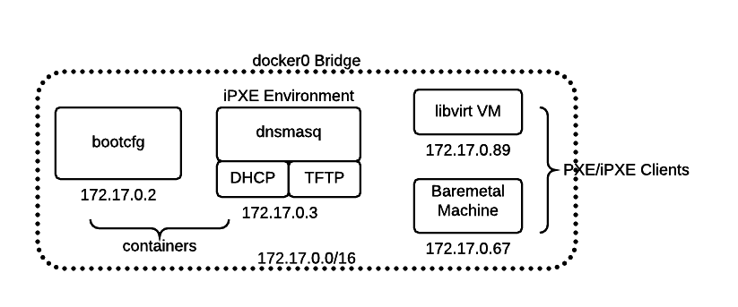

# CoreOS on Libvirt Virtual Hardware

CoreOS can be booted and configured on virtual hardware within a libvirt environment (under Linux) with different network services running as Docker containers on the `docker0` virtual bridge. Client VMs or even baremetal hardware attached to the bridge can be booted and configured from the network.

Docker containers run on the `docker0` virtual bridge, typically on a subnet 172.17.0.0/16. Docker assigns IPs to containers started through the docker cli, but the bridge does not run a DHCP service. List network bridges on your host and inspect the bridge Docker 1.9+ created (Docker cli refers to `docker0` as `bridge`).

    brctl show
    docker network inspect bridge

## Config Service

Set up `coreos/bootcfg` according to the [docs](bootcfg.md). Pull the `coreos/bootcfg` image, prepare a data volume with `Machine` definitions, `Spec` definitions and ignition/cloud configs. Optionally, include a volume of downloaded image assets.

Run the `bootcfg` container to serve configs for any of the network environments we'll discuss next.

    docker run -p 8080:8080 --name=bootcfg --rm -v $PWD/examples/dev:/data:Z -v $PWD/assets:/assets:Z coreos/bootcfg:latest -address=0.0.0.0:8080 -log-level=debug

Note, the kernel options in the `Spec` [examples](../examples) reference 172.17.0.2, the first container IP Docker is likely to assign to `bootcfg`. Ensure your kernel options point to where `bootcfg` runs.

    docker inspect bootcfg   # look for Networks, bridge, IPAddress

## Network Setups

We'll show how to setup PXE, iPXE, or Pixiecore network boot environments on the `docker0` bridge and configure them to use `bootcfg`.

The [quay.io/coreos/dnsmasq](https://quay.io/repository/coreos/dnsmasq) image can be used to run DHCP, proxyDHCP, and TFTP. It can be built from the [dockerfiles](../dockerfiles/dnsmasq) or pulled from Quay.

    docker pull quay.io/coreos/dnsmasq

### PXE

To boot PXE clients, configure a PXE network environment to [chainload iPXE](http://ipxe.org/howto/chainloading). The iPXE setup below configures DHCP to send `undionly.kpxe` over TFTP to older PXE clients for this purpose.

With `dnsmasq`, the relevant `dnsmasq.conf` settings would be:

    enable-tftp
    tftp-root=/var/lib/tftpboot
    # if PXE request came from regular firmware, serve iPXE firmware (via TFTP)
    dhcp-boot=tag:!ipxe,undionly.kpxe

### iPXE

Create a PXE/iPXE network environment by running a PXE-enabled DHCP server and TFTP server on the `docker0` bridge, alongside `bootcfg`.

```
sudo docker run --rm --cap-add=NET_ADMIN quay.io/coreos/dnsmasq -d -q --dhcp-range=172.17.0.43,172.17.0.99 --enable-tftp --tftp-root=/var/lib/tftpboot --dhcp-userclass=set:ipxe,iPXE --dhcp-boot=tag:#ipxe,undionly.kpxe --dhcp-boot=tag:ipxe,http://172.17.0.2:8080/boot.ipxe
```

The `coreos/dnsmasq` image runs DHCP and TFTP as a container. It allocates IPs in the `docker0` subnet to VMs and sends options to chainload older PXE clients to iPXE. iPXE clients are pointed to the `bootcfg` service iPXE endpoint (assumed to be running on 172.17.0.2:8080).

To run dnsmasq as a service, rather than from the commandline, the `dnsmasq.conf` might be:

```
# dnsmasq.conf
dhcp-range=172.17.0.43,172.17.0.99,30m
enable-tftp
tftp-root=/var/lib/tftpboot
# set tag "ipxe" if request comes from iPXE ("iPXE" user class)
dhcp-userclass=set:ipxe,iPXE
# if PXE request came from regular firmware, serve iPXE firmware (via TFTP)
dhcp-boot=tag:!ipxe,undionly.kpxe
# if PXE request came from iPXE, serve an iPXE boot script (via HTTP)
dhcp-boot=tag:ipxe,http://172.17.0.2:8080/boot.ipxe
```



Continue to [clients](#clients) to create a client VM or attach a baremetal machine to boot.

### Pixiecore

Create a Pixiecore network environment by running a DHCP server and `danderson/pixiecore` on the `docker0` bridge, alongside `bootcfg`. Pixiecore is a combined proxyDHCP/TFTP/HTTP server.

Run a DHCP server (not PXE-enabled)

```
sudo docker run --rm --cap-add=NET_ADMIN quay.io/coreos/dnsmasq -d -q --dhcp-range=172.17.0.43,172.17.0.99
```

Run Pixiecore, using a script which detects the `bootcfg` container IP:port on docker0.

    ./scripts/pixiecore

Continue to [clients](#clients) to create a client VM or attach a baremetal machine to boot.

## Clients

Create or attach PXE client machines to the network boot environment on the `docker0` bridge.

### libvirt VM

Create 5 libvirt VM nodes configured to boot from the network. The `scripts/libvirt` script will create 5 VM nodes with known hardware attributes, on the `docker0` bridge network.

    sudo ./scripts/libvirt
    USAGE: libvirt <command>
    Commands:
        create      create 5 libvirt nodes
        start       start 5 libvirt nodes
        reboot      reboot the 5 libvirt nodes
        shutdown    shutdown the 5 libvirt nodes
        poweroff    poweroff the 5 libvirt nodes
        destroy     destroy the 5 libvirt nodes

You may use `virt-manager` to create your own VMs and view the console/state/attributes of existing VM nodes.

When creating your own VMs, select "Network Boot with PXE" and for network selection use "Specify Shared Device" with the bridge name `docker0`.

Learn more by checking [examples](../examples) for clusters you can provision on clients.

### Bare Metal

Connect a baremetal client machine to your host's `docker0` bridge and ensure the boot firmware (probably BIOS) is configured to prefer PXE booting.

Find the network interface and attach it to the virtual bridge.

    ip link show                      # find new link e.g. enp0s20u2
    brctl addif docker0 enp0s20u2

Restart the client machine and it should PXE boot using settings from `bootcfg`.

## Next

If you'd like to boot and configure a baremetal machine network, follow the [baremetal guide](physical-hardware.md).
