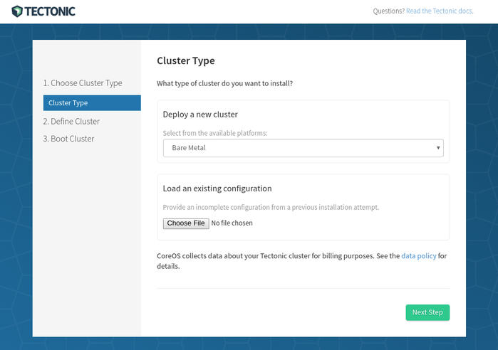
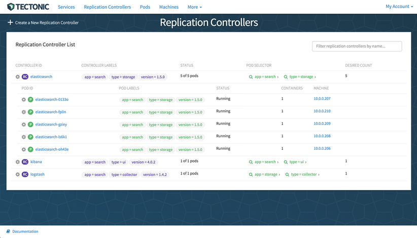

# matchbox    

Network boot and provision CoreOS clusters on virtual or physical hardware.

**Announcement**: coreos-baremetal and `bootcfg` have been renamed to CoreOS `matchbox`, which will be reflected in v0.5.0. Please see [CHANGES](CHANGES.md) or [#400](https://github.com/coreos/matchbox/issues/400). If you're looking for older docs, be sure to use the branch/tag switcher.

## Guides

* [Network Setup](Documentation/network-setup.md)
* [Machine Lifecycle](Documentation/machine-lifecycle.md)
* [Background: PXE Booting](Documentation/network-booting.md)
* Tutorials (QEMU/KVM/libvirt)
    * [matchbox with rkt](Documentation/getting-started-rkt.md)
    * [matchbox with Docker](Documentation/getting-started-docker.md)

## matchbox

`matchbox` is an HTTP and gRPC service that renders signed [Ignition configs](https://coreos.com/ignition/docs/latest/what-is-ignition.html), [cloud-configs](https://coreos.com/os/docs/latest/cloud-config.html), network boot configs, and metadata to machines to create CoreOS clusters. Groups match machines based on labels (e.g. MAC, UUID, stage, region) and use named Profiles for provisioning. Network boot endpoints provide PXE, iPXE, and GRUB. `matchbox` can be deployed as a binary, as an [appc](https://github.com/appc/spec) container with [rkt](https://coreos.com/rkt/docs/latest/), or as a Docker container.

* [matchbox Service](Documentation/matchbox.md)
* [Profiles](Documentation/matchbox.md#profiles)
* [Groups](Documentation/matchbox.md#groups)
* Config Templates
    * [Ignition](Documentation/ignition.md)
    * [Cloud-Config](Documentation/cloud-config.md)
* [Configuration](Documentation/config.md)
* [HTTP API](Documentation/api.md)
* [gRPC API](https://godoc.org/github.com/coreos/matchbox/matchbox/client)
* Installation
    * [CoreOS / Linux distros](Documentation/deployment.md)
    * [rkt](Documentation/deployment.md#rkt) / [docker](Documentation/deployment.md#docker)
    * [Kubernetes](Documentation/deployment.md#kubernetes)

### Examples

The [examples](examples) network boot and provision CoreOS clusters. Network boot [QEMU/KVM](scripts/README.md#libvirt) VMs to try the examples on your Linux laptop.

* Multi-node [Kubernetes cluster](Documentation/kubernetes.md)
* Multi-node [rktnetes](Documentation/rktnetes.md) cluster (i.e. Kubernetes with rkt as the container runtime)
* Multi-node [self-hosted](Documentation/bootkube.md) Kubernetes cluster
* [Upgrading](Documentation/bootkube-upgrades.md) self-hosted Kubernetes clusters
* Multi-node etcd2 or etcd3 cluster
* Network boot and/or install to disk (multi-stage installs)

### Enterprise

[Tectonic](https://coreos.com/tectonic/) is the enterprise-ready Kubernetes offering from CoreOS (free for 10 nodes!). The [Tectonic Installer](https://tectonic.com/enterprise/docs/latest/deployer/platform-baremetal.html) app integrates directly with `matchbox` through its gRPC API to provide a rich graphical client for populating `matchbox` with machine configs.

Learn more from our [docs](https://tectonic.com/enterprise/docs/latest/deployer/platform-baremetal.html) or [blog](https://tectonic.com/blog/tectonic-1-3-release.html).

