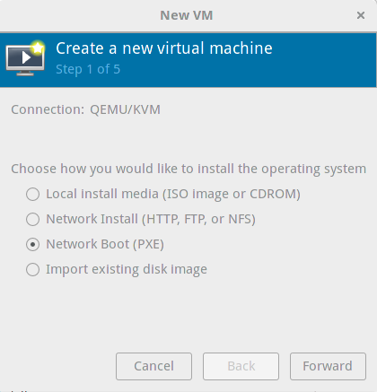

# CoreOS on Libvirt Virtual Hardware

CoreOS can be booted and configured on virtual hardware within a libvirt environment (under Linux) with different network services running as Docker containers on the `docker0` virtual bridge. Client VMs or even baremetal hardware attached to the bridge can be booted and configured from the network.

Docker containers run on the `docker0` virtual bridge, typically on a subnet 172.17.0.0/16. Docker assigns IPs to containers started through the docker cli, but the bridge does not run a DHCP service. List network bridges on your host and inspect the bridge Docker 1.9+ created (Docker cli refers to `docker0` as `bridge`).

    brctl show
    docker network inspect bridge

## Boot Config Service

First, run the `bootcfg` container with your configs and images directories.

    docker run -p 8080:8080 --name=bootcfg --rm -v $PWD/data:/data:Z -v $PWD/images:/images:Z coreos/bootcfg:latest -address=0.0.0.0:8080 -data-path=/data -images-path=/images

or use `./docker-run`.

## PXE Setups

As discussed in [getting started](getting-started.md), there are several variations of PXE network boot environments. We'll show how to setup and test each network environment.

Several setups make use of the `dnsmasq` program which can run a PXE-enabled DHCP server, proxy DHCP server, and/or TFTP server.

### PXE

To boot PXE clients, configure a PXE network environment to [chainload iPXE](http://ipxe.org/howto/chainloading). The iPXE setup below configures DHCP to send `undionly.kpxe` over TFTP to older PXE clients for this purpose.

With `dnsmasq`, the relevant `dnsmask.conf` settings would be:

    enable-tftp
    tftp-root=/var/lib/tftpboot
    # if PXE request came from regular firmware, serve iPXE firmware (via TFTP)
    dhcp-boot=tag:!ipxe,undionly.kpxe

### iPXE

Create a PXE/iPXE network environment by running the included `ipxe` container on the `docker0` bridge alongside `bootcfg`.

    cd dockerfiles/ipxe
    ./docker-build
    ./docker-run

The `ipxe` image uses `dnsmasq` to run DHCP and TFTP. It allocates IPs in the `docker0` subnet and sends options to chainload older PXE clients to iPXE. iPXE clients are pointed to the `bootcfg` service (assumed to be running on 172.17.0.2:8080) to get a boot script which loads configs.

The `ipxe` image uses the following `dnsmasq.conf`.

```
# dnsmasq.conf
dhcp-range=172.17.0.43,172.17.0.99,30m
enable-tftp
tftp-root=/var/lib/tftpboot
# set tag "ipxe" if request comes from iPXE ("iPXE" user class)
dhcp-userclass=set:ipxe,iPXE
# if PXE request came from regular firmware, serve iPXE firmware (via TFTP)
dhcp-boot=tag:!ipxe,undionly.kpxe
# if PXE request came from iPXE, serve an iPXE boot script (via HTTP)
dhcp-boot=tag:ipxe,http://172.17.0.2:8080/boot.ipxe
```


Continue to [clients](#clients) to create a client VM or attach a baremetal machine to boot.

### Pixiecore

Create a Pixiecore network environment by running the `danderson/pixiecore` container alongside `bootcfg`. Since Pixiecore is a proxyDHCP/TFTP/HTTP server and the `docker0` bridge does not run DHCP services, you'll need to run DHCP for your client machines.

The `dhcp` image uses `dnsmasq` just to provide DHCP to the `docker0` subnet.

    cd dockerfiles/dhcp
    ./docker-build
    ./docker-run

Start Pixiecore using the script which attempts to detect IP:port `bootcfg` ss using on `docker0` or do it manually.

    # Pixiecore
    ./scripts/pixiecore
    # manual
    docker run -v $PWD/images:/images:Z danderson/pixiecore -api http://$BOOTCFG_HOST:$BOOTCFG_PORT/pixiecore

Continue to [clients](#clients) to create a client VM or attach a baremetal machine to boot.

## Clients

Once a network environment is prepared to boot client machines, create a libvirt VM configured to PXE boot or attach a baremetal machine to your Docker host.

### libvirt VM

Use `virt-manager` to create a new client VM. Select Network Boot with PXE and for the network selection, choose "Specify Shared Device" with the bridge name `docker0`.



The VM should PXE boot using the boot config and cloud config based on its UUID, MAC address, or your configured defaults. The `virt-manager` shows the UUID and the MAC address of the NIC on the shared bridge, which you can use when naming configs.

### Bare Metal

Connect a baremetal client machine to your libvirt Docker host machine and ensure that the client's boot firmware (probably BIOS) has been configured to prefer PXE booting.

Find the network interface and attach it to the virtual bridge.

    ip link show                      # find new link e.g. enp0s20u2
    brctl addif docker0 enp0s20u2

Restart the client machine and it should PXE boot using the boot config and cloud config based on its UUID, MAC address, or your configured defaults.

## Next

If you'd like to boot and configure a baremetal machine network, follow the [baremetal guide](physical-hardware.md).